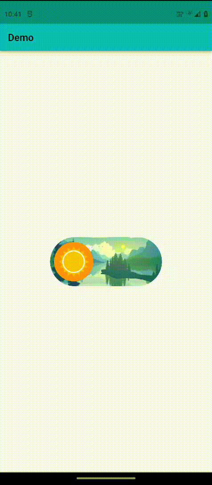
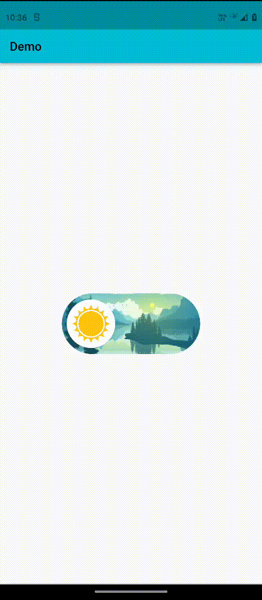
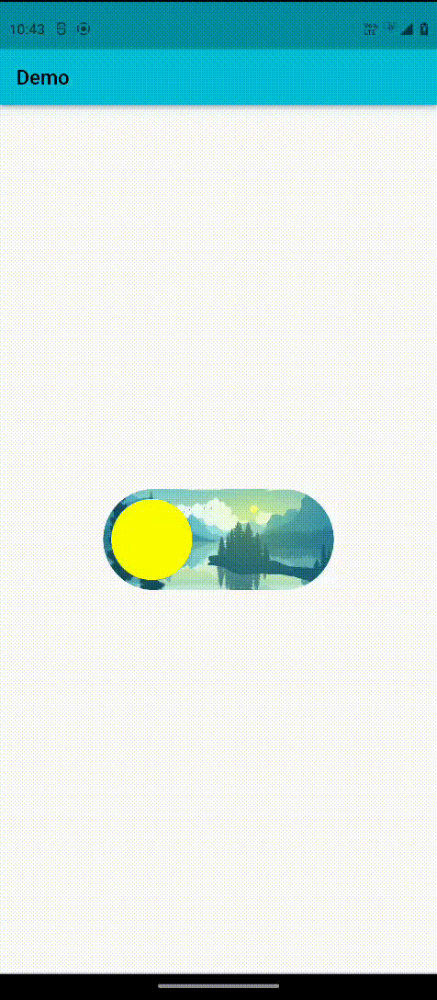

# Fancy Dark Mode Toggle App

An example project for this [package](https://pub.dev/packages/fancy_switch). It uses FancySwitch widget to create dark mode theme toggle for the app.

## Snapshots

   

## Project dependencies

- [fancy_switch](https://pub.dev/packages/fancy_switch)
- [provider](https://pub.dev/packages/provider)

## Support the pacakge (optional)

If you find this [package](https://pub.dev/packages/fancy_switch) useful, you can support it for free by giving it a thumbs up. Here's another option to support the package:

